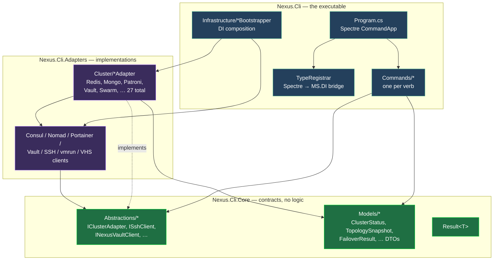
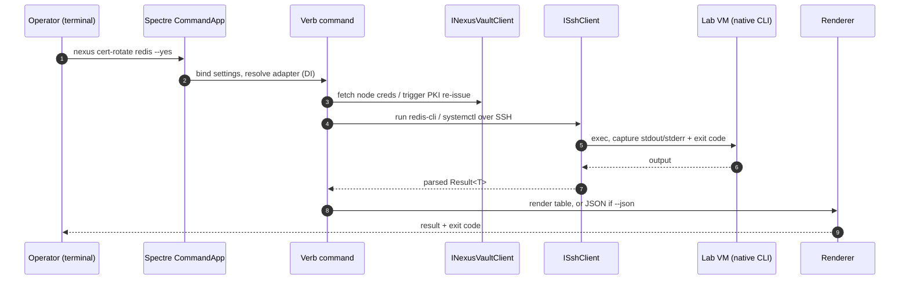

# nexus-cli — Architecture

> **Read this first.** The map of the whole tool: *what* it is, *why* it is shaped this way, *how*
> a command flows from the terminal down to a live lab VM, and *how the pieces affect each other*.
> Diagrams render natively on GitHub (Mermaid). Kept current every release.

---

## 1. What we are building — and why

`nexus-cli` is the **single operator surface** for the NexusPlatform lab (140 VMs through Phase
0.P). It is one **≤30 MB Native-AOT** binary (`nexus`) that introspects, drives, and recovers the
lab's control planes — so day-to-day operations are **predictable verbs with panic buttons**, not
raw `terraform` / `vault` / `docker stack` invocations.

The design is dominated by three forces:

| Force | Decision | Why |
|---|---|---|
| Ship a tiny, dependency-light binary that starts instantly | **Native AOT**, and **no managed DB drivers** | AOT gives a fast, self-contained binary; linking StackExchange.Redis / MongoDB.Driver / Npgsql / … would bloat it and fight trimming. |
| Talk to a dozen different engines uniformly | **SSH shell-out to each node's own native CLI** (`redis-cli`, `mongosh`, `mysql`, `patronictl`, `clickhouse-client`, `sqlcmd`, …) | The engine's own client already speaks its protocol; we borrow it over SSH and parse the output. One transport, every engine. |
| One command shape across 20+ clusters | The **`IClusterAdapter` SPI** — one adapter per cluster | Commands stay generic (`status <cluster>`); the per-engine specifics live behind a stable interface, enforced by NetArchTest. |

---

## 2. Layered architecture

Three source projects with a strict dependency direction — the `Cli` (Spectre.Console commands) and
the `Adapters` (concrete implementations) both depend on `Core` (the contracts); nothing depends on
`Cli`.



**Why this shape:**
- **`Core` holds only contracts + DTOs** (interfaces, models, `Result<T>`) — no behavior. Both the
  commands and the adapters compile against it, so neither knows the other's concrete types.
- **`Adapters` is the only place engine specifics live.** Every `*Adapter` implements
  `IClusterAdapter`; NetArchTest forbids any adapter from referencing a managed DB-driver type,
  which is what keeps the AOT footprint flat (~150–300 KB per adapter).
- **`Cli` is the composition root.** `Program.cs` builds the Spectre `CommandApp`; the
  `*Bootstrapper` classes register services into MS.DI, bridged to Spectre via `TypeRegistrar`.

---

## 3. The `IClusterAdapter` SPI — one contract, every cluster

Each verb command is generic: it resolves the named cluster's adapter from the registry and calls
the matching SPI method. Adding a new cluster = writing one adapter; the commands do not change.

```mermaid
flowchart LR
    U[operator] -->|nexus status redis| C[ClusterStatusForClusterCommand]
    C --> R[IClusterRegistry.Resolve&#40;'redis'&#41;]
    R --> A[RedisAdapter : IClusterAdapter]
    A -->|SSH: redis-cli cluster info| N[(redis node)]
    N --> A
    A --> RES[Result&lt;ClusterStatus&gt;]
    RES --> RENDER[ClusterRender → Spectre table / --json]
    RENDER --> U
```



The SPI verbs (see [`IClusterAdapter`](../src/Nexus.Cli.Core/Abstractions/IClusterAdapter.cs)):
`GetStatus` · `Failover` · `ScaleOutAdd/Remove` · `Health` · `Topology` · `BackupTake/Restore` ·
`RotateCert` · `ApplyChaos` · `Acl` · `CanResizeVm`. A cluster that genuinely cannot support a verb
returns an actionable "not applicable" rather than faking it.

---

## 4. How a command flows end-to-end



Everything is a `Result<T>` (`Core/Result.cs`): failures are returned and rendered, not thrown, so
the process exit code and the operator message are always deliberate.

---

## 5. What the CLI touches (and the blast radius of a mistake)

The tool is **mostly read-only introspection**; the mutating verbs are guarded.

| Surface | Verbs | Guard / blast radius |
|---|---|---|
| **VMware host** (vmrun) | `infrastructure suspend/resume`, `scale-up`, host-level `failover-test` | Confirmation prompts (`--yes`); `scale-up` refuses a write-primary/KRaft-controller unless `--force-primary`. |
| **Vault** (HTTP + SSH) | `recover-ha`, `cert-rotate`, `acl` | `recover-ha` is the *only* exposed unseal path; mutating verbs target standbys where possible. |
| **Cluster data** | `backup restore`, `chaos` | `restore` is DESTRUCTIVE — gated behind `--yes` / `--confirm-destructive`; `chaos` is time-boxed. |
| **Control planes** (Consul/Nomad/Swarm) | `failover-test`, `cluster-status` | Failover auto-recovers (resume the suspended leader) and measures RTO. |

The load-bearing safety idea: **no managed drivers + SSH shell-out means the CLI can only do what an
operator could do by hand on the node** — there is no hidden privileged data path, and every
mutating action is explicit and confirmable.

---

## 6. Native AOT, build & enforcement

- **Native AOT** — `Nexus.Cli` publishes to a single ≤30 MB binary. `AotRoots.KeepAlive()` and the
  `NexusJsonContext` source-generated serializer keep reflection-free.
- **No managed DB drivers** — enforced by NetArchTest (`Nexus.Cli.Tests/Architecture`).
- **Documentation** — `GenerateDocumentationFile` is on for `src`, so every undocumented public
  member is a CS1591 error under warnings-as-errors. (This retrofit turned that on.)
- **Warnings are errors**; `dotnet format --verify-no-changes` gates style; 330+ tests
  (NetArchTest + JSON round-trips + parser permutations).

---

## 7. Where the code lives

```
src/
  Nexus.Cli/          the executable — Program.cs, Commands/*, Infrastructure/* (DI bootstrappers)
  Nexus.Cli.Core/     contracts only — Abstractions/* (interfaces), Models/* (DTOs), Result<T>
  Nexus.Cli.Adapters/ implementations — Cluster/*Adapter (27) + Consul/Nomad/Portainer/Vault/SSH/vmrun/VHS clients
tests/
  Nexus.Cli.Tests/    NetArchTest layer rules + JSON contract round-trips + env-resolver permutations
docs/
  architecture.md     this file
```
